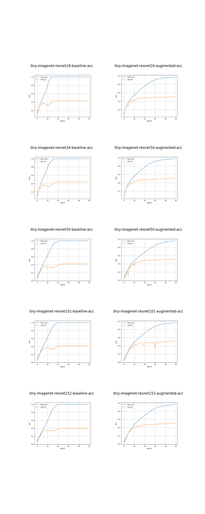
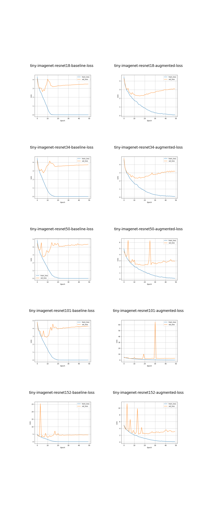

# DL Fundamentals Unit 7 Exercise - Tiny ImageNet

My solution for [DL Fundamentals Unit 7 Exercise](https://github.com/Lightning-AI/dl-fundamentals/tree/main/unit07-computer-vision/exercises/exercise-1-imagenet). The exercise essentially asks you to train a resnet from ImageNet dataset. Due to the large size of ImageNet, the version with Tiny ImageNet is more practical for most people.

## Code
* local_utilities.py: defines the DataModule for Tiny ImageNet.
* training.py: the script for training models. I split this out as a separate python script because I wanted to run it with a tmux on Google Cloud so that I don't need to worry about weirdness caused by losing connections when the models are being trained.
* tiny-imagenet-resnet.ipynb: the notebook that I used to run sanity checks of the dataset, plotting training/validation loss/accuracy curves, and testing the trained models against test set.

## Models
I trained all variants of vanilla resnet available on torch hub (resnet18, resnet34, resnet50, resnet101, resnet152). For each model variant, a baseline model was trained without data augementation and an enhanced model was trained by applying the image agumentation techniques taught in the course. On a Google Cloud virtual machine with a single NVIDIA V100 GPU, it took 60 hours to train all 10 models.

## Result
The best performing model was resnet50 with data augmentaion applied, which achieved 53.5% test accuracy.

### Test accuracy
| Baseline Model Name | Test Accuracy | Augmented Model Name | Test Accuracy |
| ------ | ----- | ----- | ----- |
| tiny-imagenet-resnet18-baseline | 0.4458000063896179 | tiny-imagenet-resnet18-augmented | 0.5205000042915344 |
| tiny-imagenet-resnet34-baseline | 0.4474000036716461 | tiny-imagenet-resnet34-augmented | 0.5231000185012817 |
| tiny-imagenet-resnet50-baseline | 0.4223000109195709 | tiny-imagenet-resnet50-augmented | **0.5349000096321106** |
| tiny-imagenet-resnet101-baseline | 0.43290001153945923 | tiny-imagenet-resnet101-augmented | 0.5210999846458435 |
| tiny-imagenet-resnet152-baseline | 0.4162999987602234 | tiny-imagenet-resnet152-augmented | 0.524399995803833 |

### Training/validation accuracy

### Training/validation loss

